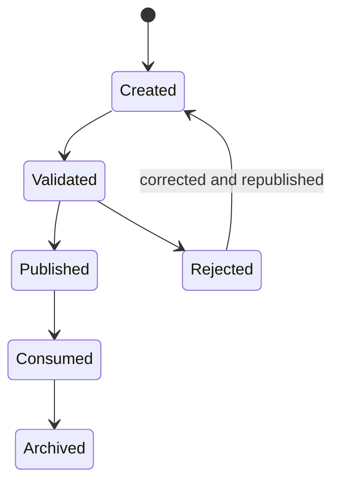

# Event Contracts

Contract Version: 1.0.0  
Effective Date: 2026-06-30  
Status: Approved

## 1. Purpose and Scope
This document defines event naming, categories, payload schemas, and lifecycle semantics for the platform event bus.

Related contracts:
- artifact-contracts.md
- workflow-state.md
- memory-contract.md
- approval-contract.md
- validation-contract.md

## 2. Event Model Principles
1. Every significant runtime transition emits an event.
2. Events are immutable after publication.
3. Event payloads are schema-validated before publish.
4. Events reference artifacts and memory entries; they do not embed full artifacts.
5. Event ordering is guaranteed per workflowId and executionId.

## 3. Naming Convention
Format:
AgentName.EventCategory.EventAction.v<major>

Examples:
- Supervisor.Lifecycle.WorkflowCreated.v1
- BusinessAnalyst.Success.RequirementsCompleted.v1
- QAEngineer.Blocked.TestEnvironmentUnavailable.v1
- Reviewer.Failure.ComplianceCheckFailed.v1
- Supervisor.Approval.Requested.v1

Rules:
- PascalCase segments.
- Stable major version suffix in event name.
- Category must be one of: Success, Blocked, Failure, Lifecycle, Approval, Retry, Memory.

## 4. Base Payload Schema (All Events)
Required fields:
- eventId: Globally unique event identifier.
- workflowId: Workflow identifier.
- executionId: Execution identifier.
- agentId: Emitting agent identifier.
- timestamp: ISO-8601 timestamp.
- status: Created | Queued | Running | Waiting | Blocked | WaitingForApproval | Retrying | Resumed | Completed | Failed | Cancelled.
- artifacts: List of artifact references impacted by this event.
- duration: Execution duration in milliseconds for the relevant operation.
- confidence: Numeric confidence score, range 0.0 to 1.0.
- warnings: Non-fatal warning list.
- errors: Error list; empty for non-error events.

Optional fields:
- correlationId: Parent correlation identifier.
- causationEventId: Triggering event identifier.
- retryMetadataRef: Reference to retry record.
- approvalRef: Reference to approval request/response.
- memoryRef: Reference to memory snapshot entry.

Example payload:
```yaml
eventId: evt-92fe1f8f
workflowId: wf-2026-06-30-001
executionId: exec-0142
agentId: solution-architect
timestamp: 2026-06-30T10:14:00Z
status: Completed
artifacts:
  - artifactId: art-architecture-0007
    artifactType: architecture.md
    version: 1.2.0
duration: 48231
confidence: 0.94
warnings: []
errors: []
correlationId: corr-0051
```

## 5. Event Categories and Required Extensions

### 5.1 Success Events
Purpose: Confirm successful completion of a stage or operation.

Required extension fields:
- resultSummary
- producedArtifacts

Example names:
- BusinessAnalyst.Success.RequirementsCompleted.v1
- SolutionArchitect.Success.ArchitectureCompleted.v1
- DevOpsRelease.Success.ReleaseCompleted.v1

### 5.2 Blocked Events
Purpose: Report inability to proceed without intervention.

Required extension fields:
- blockerCode
- blockerReason
- requiredAction
- openQuestionsRef

Example names:
- BackendDeveloper.Blocked.ExternalDependencyMissing.v1
- QAEngineer.Blocked.TestDataUnavailable.v1

### 5.3 Failure Events
Purpose: Report terminal failure for operation or workflow branch.

Required extension fields:
- failureCode
- failureReason
- failedStep
- recoveryOptions

Example names:
- Reviewer.Failure.SecurityGateFailed.v1
- Supervisor.Failure.WorkflowExecutionFailed.v1

### 5.4 Lifecycle Events
Purpose: Track workflow and agent runtime states.

Required extension fields:
- previousState
- newState
- transitionReason

Example names:
- Supervisor.Lifecycle.WorkflowCreated.v1
- Supervisor.Lifecycle.WorkflowCompleted.v1
- BackendDeveloper.Lifecycle.AgentStarted.v1

### 5.5 Approval Events
Purpose: Manage human approval lifecycle through Supervisor and Approval Service.

Required extension fields:
- approvalId
- approvalType
- approvalStatus
- approvalDeadline

Example names:
- Supervisor.Approval.Requested.v1
- ApprovalService.Approval.DecisionRecorded.v1
- Supervisor.Approval.Resumed.v1

### 5.6 Retry Events
Purpose: Capture retry attempts and outcomes.

Required extension fields:
- retryCount
- retryLimit
- retryReason
- backoffPolicy

Example names:
- BackendDeveloper.Retry.AttemptStarted.v1
- BackendDeveloper.Retry.AttemptCompleted.v1
- Supervisor.Retry.Exhausted.v1

### 5.7 Memory Events
Purpose: Track memory writes, snapshots, and compaction.

Required extension fields:
- memoryScope
- memoryOperation
- memoryEntryRef

Example names:
- Supervisor.Memory.WorkflowMemoryUpdated.v1
- AgentRunner.Memory.ExecutionSnapshotCreated.v1

## 6. Canonical Success Events by Agent
- BusinessRequirementsCompleted
- ArchitectureCompleted
- UIDevelopmentCompleted
- BackendCompleted
- DatabaseCompleted
- QACompleted
- ReviewCompleted
- ReleaseCompleted
- DocumentationCompleted

These canonical names are emitted as EventAction values under Success category.

## 7. Delivery and Idempotency
1. Delivery guarantee: At-least-once.
2. Consumers must implement idempotency using eventId.
3. Duplicate events with same eventId must be ignored after first successful processing.
4. Ordering key: workflowId + executionId.

## 8. Event Lifecycle


## 9. Error and Warning Contract
- warnings[] entries:
  - code
  - message
  - severity: Low | Medium | High
  - relatedArtifactRef (optional)
- errors[] entries:
  - code
  - message
  - category: Validation | Business | System | Security | Timeout
  - retryable: true | false
  - detailsRef (optional)

## 10. Compatibility and Versioning
- Event major version in name controls schema compatibility.
- New optional fields: MINOR-compatible.
- Removing or changing required fields: MAJOR increment.
- PATCH changes are editorial and do not alter schema meaning.
