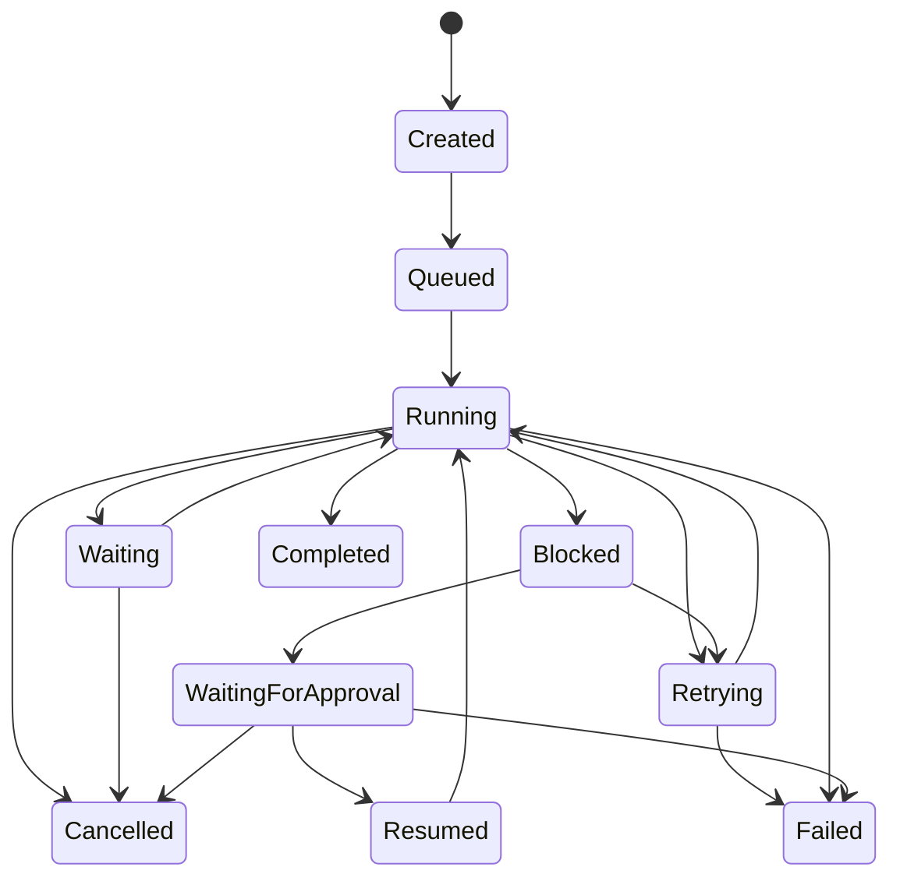

# Workflow State Contract

Contract Version: 1.0.0  
Effective Date: 2026-06-30  
Status: Approved

## 1. Purpose and Scope
This document defines the workflow state machine for orchestration, supervisor control, recovery, timeout, and persistence behavior.

Related contracts:
- event-contracts.md
- memory-contract.md
- approval-contract.md
- validation-contract.md

## 2. State Definitions
- Created: Workflow metadata created; no execution units enqueued.
- Queued: Workflow accepted and waiting for scheduler slot.
- Running: One or more agents are actively executing.
- Waiting: Workflow paused for non-approval dependency (for example, resource or ordering wait).
- Blocked: Workflow cannot proceed due to unresolved blocker.
- WaitingForApproval: Workflow paused pending human approval decision through Supervisor.
- Retrying: Workflow is executing a retry attempt after validation or recoverable failure.
- Resumed: Workflow restarted from Waiting, Blocked, or WaitingForApproval.
- Completed: All required stages and artifacts are finalized.
- Failed: Unrecoverable failure or retry exhaustion.
- Cancelled: Explicit termination by Supervisor policy or operator command.

## 3. Allowed Transitions
- Created -> Queued
- Queued -> Running
- Running -> Waiting
- Running -> Blocked
- Running -> WaitingForApproval
- Running -> Retrying
- Running -> Completed
- Running -> Failed
- Running -> Cancelled
- Waiting -> Running
- Waiting -> Cancelled
- Blocked -> WaitingForApproval
- Blocked -> Retrying
- Blocked -> Failed
- WaitingForApproval -> Resumed
- WaitingForApproval -> Failed
- WaitingForApproval -> Cancelled
- Retrying -> Running
- Retrying -> Failed
- Resumed -> Running
- Resumed -> Failed

Terminal states:
- Completed
- Failed
- Cancelled

## 4. Invalid Transitions
Invalid transitions include, but are not limited to:
- Created -> Completed
- Queued -> Completed
- Completed -> Running
- Failed -> Running
- Cancelled -> Running
- WaitingForApproval -> Completed
- Blocked -> Completed

Behavior on invalid transition:
1. Reject transition.
2. Emit Failure event: Supervisor.Failure.InvalidStateTransition.v1.
3. Persist audit record with attempted source and target states.

## 5. Recovery Behavior
- Recoverable errors move state to Retrying if retry policy permits.
- Retry context includes retry count, reason, and backoff metadata.
- If recovery succeeds, transition Retrying -> Running.
- If retry limit reached, transition Retrying -> Failed.
- Blocked workflows may transition to WaitingForApproval if exception handling or override is required.

## 6. Timeout Behavior
Timeout classes:
- Agent execution timeout
- External dependency timeout
- Approval response timeout

Timeout handling:
1. Emit category-specific Failure or Blocked event.
2. Persist timeout metadata in execution memory.
3. Apply retry policy if timeout is retryable.
4. Transition to WaitingForApproval when policy requires explicit human decision.
5. Transition to Failed when timeout is non-retryable or retry exhausted.

## 7. Supervisor Responsibilities
- Initialize workflow in Created state.
- Authorize all state transitions.
- Ensure transition legality against this contract.
- Trigger approval flow for WaitingForApproval.
- Resume workflow after approved decisions.
- Enforce retry and timeout policies.
- Mark terminal states and finalize audit trail.

Open-question transition rule:
- If any structured open question has Blocking = Yes, Supervisor transitions workflow to WaitingForApproval or Blocked per policy.
- If open-question Workflow Status is READY and prerequisites are met, Supervisor may continue normal progression.
- Continuation decisions must use only Blocking, Approval Required, and Workflow Status metadata fields.

## 8. State Persistence Rules
1. Every state transition is persisted atomically with transition eventId.
2. Persisted record fields:
   - workflowId
   - executionId
   - previousState
   - newState
   - changedBy (agentId or Supervisor)
   - timestamp
   - reasonCode
   - relatedEventId
3. State persistence is append-only; no in-place history mutation.
4. Latest state is derived from most recent valid transition record.
5. Persistence writes must be durable before publishing transition-completed events.

## 9. State Machine Reference Diagram

## 10. Cross-Contract Alignment
- Approval-triggering states and metadata must follow approval-contract.md.
- Retry transitions must emit Retry category events per event-contracts.md.
- Persistence records must use memory references defined in memory-contract.md.
- Validation gates that trigger Blocked or Retrying states must follow validation-contract.md.
