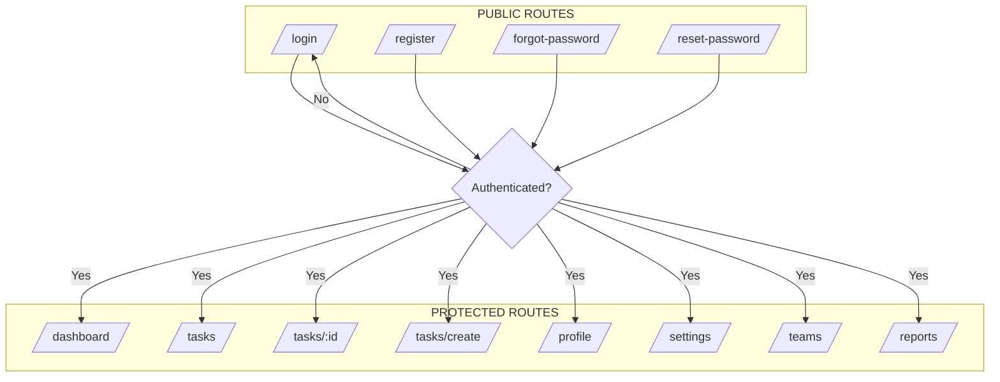
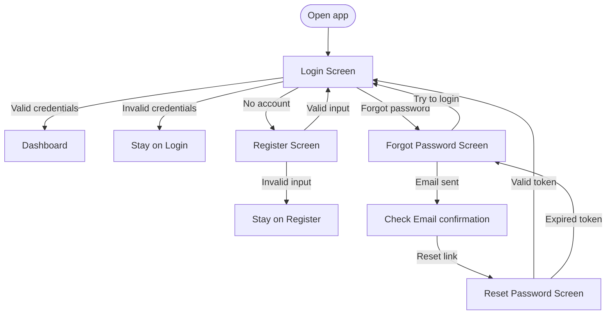
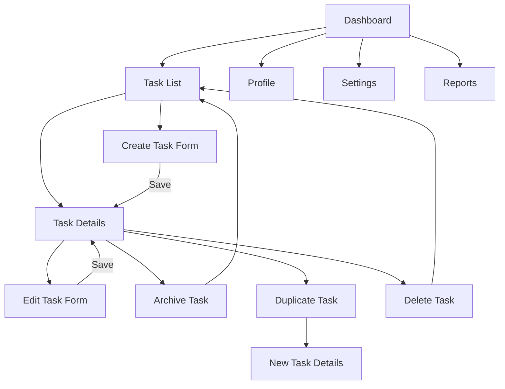

# User Flow Specification

## Purpose
Define screen navigation, workflows, and state transitions for the Task Management System.

## Metadata
- Version: 1.0
- Author: Solution Architect
- Date: 2026-07-04
- Status: Draft
- Artifact ID: USER-FLOW-001
- Figma Reference: https://www.figma.com/make/YnxUzBz6USzrnokLtV4Jd0/Task-Management-System-Screens

---

## Navigation Architecture



---

## Screen Flows

### Authentication Flow



---

### Task Management Flow



---

### Collaboration Flow

```
[Task Details]
  │
  ├─ Comments Section
  │   │
  │   ├─→ "Add Comment" input field
  │   │     │
  │   │     ├─ User types comment
  │   │     ├─ Optional: @mention user
  │   │     ├─→ Submit → Comment created
  │   │     │     ├─ Notify: task owner, assignee, other commenters
  │   │     │     ├─ Notification respects user preferences
  │   │     │     └─ Comment appears in activity feed
  │   │     │
  │   │     └─→ Cancel → Discard comment
  │   │
  │   ├─ Comment List
  │   │   │
  │   │   ├─→ Hover comment → Show edit/delete options (if authorized)
  │   │   │     │
  │   │   │     ├─→ Edit → [Comment Edit Form] → Update → Comment updated (show "edited" marker)
  │   │   │     │
  │   │   │     └─→ Delete → Confirm → Comment deleted
  │   │   │
  │   │   └─ Show: author, timestamp, content, edit history if edited
  │   │
  │   └─→ Pagination (20 comments per page if many)
  │
  ├─ Attachment Section
  │   │
  │   ├─→ "Add Attachment" button → File picker
  │   │     │
  │   │     ├─ Select file → Upload → Show in attachment list
  │   │     ├─ Size limit validation (e.g., 10MB)
  │   │     ├─ Format validation (common file types)
  │   │     └─→ Cancel upload
  │   │
  │   └─ Attachment List
  │       │
  │       ├─ Show: filename, size, upload date, uploader
  │       │
  │       ├─→ Click → Download file
  │       │
  │       └─→ Delete (uploader/admin) → Confirm → Attachment removed
  │
  └─→ Return to Task Details main view
```

---

### Notification & Preference Flow

```
[Settings]
  │
  ├─ Notification Preferences section
  │   │
  │   ├─→ Toggle: "In-app Notifications" (required)
  │   │
  │   ├─→ Toggle: "Email Notifications" (optional)
  │   │
  │   ├─→ Per-event preferences (if email enabled)
  │   │     ├─ Email on task assignment
  │   │     ├─ Email on task status change
  │   │     ├─ Email on comment added
  │   │     └─ Email when mentioned
  │   │
  │   ├─→ Save preferences → Confirmation message → Preferences updated
  │   └─→ Related AC: AC-014
  │
  └─ Other settings...

[Notification Center] (optional sidebar/icon)
  │
  ├─ Unread notification count badge
  │
  ├─→ Click bell icon → Notification dropdown
  │     │
  │     ├─ List unread notifications (newest first)
  │     │   │
  │     │   ├─ Task created notification
  │     │   ├─ Task status changed notification
  │     │   ├─ Comment added notification
  │     │   ├─ Assigned to task notification
  │     │   └─ Mentioned in comment notification
  │     │
  │     ├─→ Click notification → Navigate to [Task Details]
  │     │     └─ Mark notification as read
  │     │
  │     ├─→ "Mark all as read" button
  │     │
  │     └─→ "Settings" link → [Settings] Notification Preferences
  │
  └─ In-app notification toast
      │
      ├─ Show as non-intrusive toast (top-right)
      ├─ Auto-dismiss after 5 seconds
      ├─ Include action link (go to task, dismiss)
      └─ Respect notification preferences
```

---

### Reporting & Dashboard Flow

```
[Dashboard]
  │
  ├─ Summary Metrics Section
  │   │
  │   ├─ Total Tasks (all visible to user)
  │   ├─ Completed Tasks (status = completed)
  │   ├─ Pending Tasks (status != completed and not archived)
  │   ├─ Overdue Tasks (due_date < today and status != completed)
  │   ├─ Due Today Tasks (due_date = today and status != completed)
  │   │
  │   └─ Metrics calculated from visible task set:
  │       ├─ Admin: sees all tasks
  │       ├─ Team Lead: sees team tasks + own tasks
  │       └─ Team Member: sees own + assigned + team tasks
  │
  ├─ Recent Activity Feed
  │   │
  │   ├─ Show: task creation, status changes, comments (recent first)
  │   ├─ Show: author, action, task link, timestamp
  │   │
  │   └─→ Click activity → Navigate to [Task Details]
  │
  ├─→ "View All Tasks" link → [Task List]
  │
  ├─→ "View Overdue" quick link → [Task List] filtered to overdue
  │
  ├─→ "View Due Today" quick link → [Task List] filtered to due today
  │
  └─ Dependency unavailable
      └─ Show: "Metrics loading..." or explicit error → Allow retry

[Reports] (Team Lead/Admin only)
  │
  ├─ Team selector (admin sees all teams)
  │
  ├─ Workload Report
  │   │
  │   ├─ Show: tasks per team member
  │   ├─ Show: completion rate per member
  │   ├─ Show: overdue count per member
  │   │
  │   └─→ Click member → Filter [Task List] to member's tasks
  │
  ├─ Productivity Report
  │   │
  │   ├─ Date range selector
  │   │
  │   ├─ Show: tasks completed per day/week/month
  │   ├─ Show: average time to completion
  │   ├─ Show: status distribution trends
  │   │
  │   └─→ Drill down → [Task List] for period
  │
  └─ Export reports (future feature)
```

---

### Profile & Settings Flow

```
[Profile]
  │
  ├─ Display User Information
  │   │
  │   ├─ Avatar (image)
  │   ├─ Full Name
  │   ├─ Email (read-only)
  │   ├─ Contact Information
  │   ├─ Role (read-only, admin-assigned)
  │   ├─ Member Since (read-only, account creation date)
  │   │
  │   └─→ "Edit Profile" button → Enter edit mode
  │        │
  │        ├─ Avatar: "Change Avatar" → File picker → Upload
  │        ├─ Full Name: Edit text field
  │        ├─ Contact Info: Edit text field
  │        │
  │        ├─→ Save changes → Validate → Profile updated → Show confirmation
  │        ├─→ Cancel → Discard edits → Back to view mode
  │        └─ Validation errors show inline
  │
  ├─ Security Section
  │   │
  │   └─→ "Change Password" button
  │        │
  │        ├─ Old password field (required)
  │        ├─ New password field (min 8 chars, required)
  │        ├─ Confirm password field (must match)
  │        │
  │        ├─→ Submit → Validate password → Update → Confirmation + "Please log in again"
  │        │              → Auto-logout → [Login Screen]
  │        │
  │        └─→ Cancel → Back to profile
  │
  └─→ [Settings] button → [Settings Screen]

[Settings]
  │
  ├─ Appearance Preferences
  │   ├─ Theme: Light, Dark, System default
  │   ├─ Language: English, Spanish, French, etc.
  │   └─ Timezone: Select from list
  │
  ├─ Notification Preferences (see Collaboration Flow above)
  │
  ├─ Privacy Preferences
  │   ├─ Profile visibility (public to team, private)
  │   ├─ Task default visibility (personal, team, organization)
  │   └─ Data retention preferences
  │
  ├─→ Save settings → Confirmation → Settings persisted
  │
  ├─→ Reset to defaults → Confirm → Back to default preferences
  │
  ├─ Administrative Controls (admin only)
  │   ├─→ User Management link → [User Management] (future)
  │   ├─→ Team Management link → [Team Management] (future)
  │   └─→ System Settings link → [System Settings] (future)
  │
  └─→ Logout button
       └─→ Confirm → Session terminated → [Login Screen]
```

---

### Team Management Flow (Admin/Team Lead)

```
[Teams]
  │
  ├─ List of teams (current user is member of)
  │
  ├─→ Click team → [Team Details]
  │
  ├─→ "Create Team" button (admin only)
  │     │
  │     ├─ Team name (required, unique)
  │     ├─ Description (optional)
  │     │
  │     ├─→ Create → Team created → [Team Details]
  │     └─→ Cancel → Back to [Teams]
  │
  └─ Filter by: owner, membership status

[Team Details]
  │
  ├─ Team Information
  │   ├─ Name
  │   ├─ Description
  │   ├─ Owner
  │   ├─ Created date
  │   │
  │   └─→ "Edit Team" (owner/admin only)
  │        ├─ Update name, description
  │        ├─→ Save → Update confirmed
  │        └─→ Cancel → Discard edits
  │
  ├─ Members Section
  │   │
  │   ├─ List team members with roles
  │   │
  │   ├─→ "Add Member" button (owner/admin)
  │   │     │
  │   │     ├─ Select user from dropdown
  │   │     ├─ Assign role (Team Lead, Team Member)
  │   │     │
  │   │     ├─→ Add → Member added → Update list
  │   │     └─→ Cancel → Back to member list
  │   │
  │   ├─→ Remove member (owner/admin)
  │   │     └─→ Confirm → Member removed → Update list
  │   │
  │   └─ Show: member name, email, role, joined date
  │
  ├─→ "View Team Tasks" link → [Task List] filtered to team
  │
  └─→ Back to [Teams]
```

---

## Permission-Based Visibility

| Screen | Admin | Team Lead | Team Member | Anonymous |
|--------|-------|-----------|-------------|-----------|
| Login | ✓ | ✓ | ✓ | ✓ |
| Register | ✓ | ✓ | ✓ | ✓ |
| Dashboard | ✓ | ✓ | ✓ | ✗ |
| Task List | ✓ (all) | ✓ (team+own) | ✓ (own+assigned) | ✗ |
| Task Details | ✓ (all) | ✓ (team+own) | ✓ (own+assigned) | ✗ |
| Create Task | ✓ | ✓ | ✓ | ✗ |
| Edit Task | ✓ | ✓ (team+own) | ✓ (own+assigned) | ✗ |
| Delete Task | ✓ | ✗ | ✗ | ✗ |
| Profile | ✓ (own+all) | ✓ (own) | ✓ (own) | ✗ |
| Settings | ✓ (own+all) | ✓ (own) | ✓ (own) | ✗ |
| Teams | ✓ (all) | ✓ (member) | ✓ (member) | ✗ |
| Reports | ✓ (all) | ✓ (team) | ✗ | ✗ |
| Administration | ✓ | ✗ | ✗ | ✗ |

---

## Error & Dependency-Unavailable States

Each screen handles unavailable dependencies gracefully:

```
Scenario: Task database unavailable
  │
  ├─→ Task List: Show "Tasks unavailable, please try again"
  ├─→ Task Details: Show read-only view with "Updates unavailable"
  ├─→ Create Task: Show form with "Save unavailable, try again"
  └─→ Dashboard: Show cached metrics with "Real-time data unavailable"
```

---

## State Transitions & Validation

### Task Status Transitions
```
Todo ──→ In Progress ──→ Review ──→ Completed
  ↓          ↓            ↓           ↓
  └─ Blocked ←──── Blocked ←──── Blocked
```

- From any state → Blocked (temporary hold)
- From Blocked → Previous state or next state (manual reset)
- Cannot bypass states (no Todo → Review)
- Completed tasks locked from editing (non-admin)
- Admin can force any transition

---

## Responsive Behavior

- **Desktop (1024px+):** Full sidebar navigation, multi-column layouts
- **Tablet (768px-1023px):** Collapsed sidebar, stacked layouts, touch-friendly buttons
- **Mobile (< 768px):** Hidden sidebar (hamburger menu), single-column, large touch targets

---

## Related Documents

- [api-specifications.md](api-specifications.md) – API endpoints supporting these flows
- [architecture-design.md](architecture-design.md) – Routing layer design
- Figma Design: https://www.figma.com/make/YnxUzBz6USzrnokLtV4Jd0/Task-Management-System-Screens

---

## Document Control

- **Document ID:** USER-FLOW-001
- **Version:** 1.0
- **Author:** Solution Architect
- **Status:** Ready for UI/UX Developer Handoff
