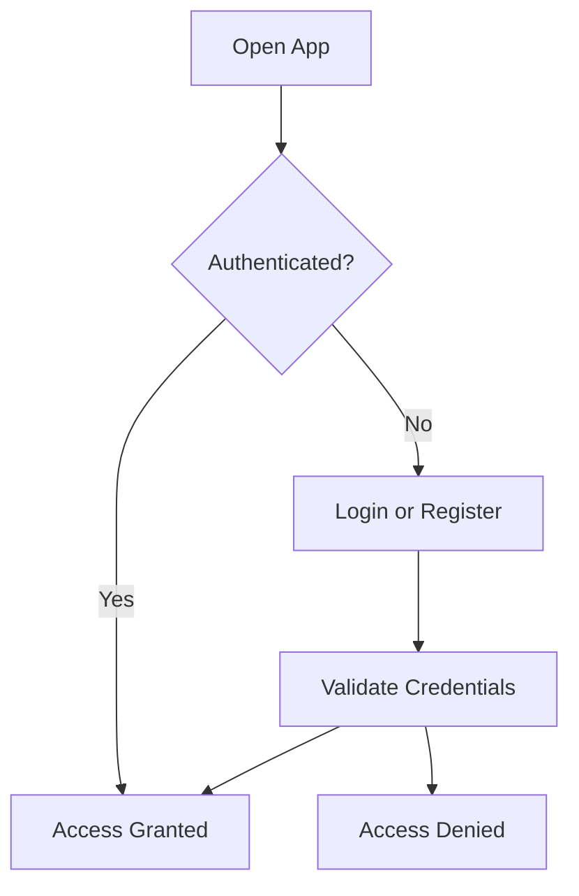
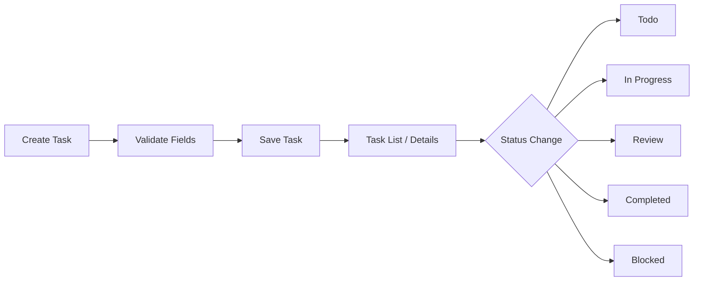
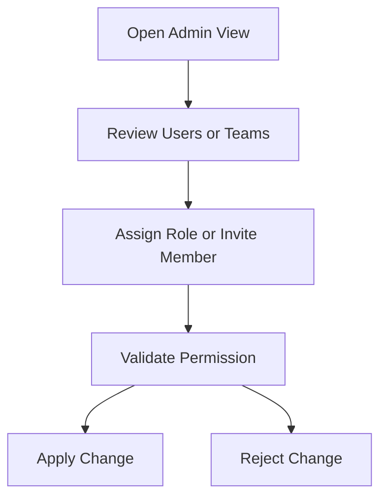

# Business Process Flows

## Metadata
- Version: 1.0
- Author: Business Analyst
- Date: 2026-07-06
- Workflow ID: WF-20260705-001
- Status: Draft

## Business Process Flows

### Process Name: User Authentication and Account Recovery
- Objective: Allow secure sign-in, account recovery, and access to protected features.
- Trigger: A user opens the application and chooses to register, sign in, or recover access.
- Preconditions: The user has valid account details or a registration request.
- Main Flow:
  1. User enters credentials or chooses recovery.
  2. System validates identity and access requirements.
  3. User receives access or recovery guidance.
- Alternate Flow:
  1. User uses remember-me or OAuth sign-in.
  2. System recognizes the session and grants access.
- Exception Flow:
  1. Invalid credentials or recovery errors are shown clearly.
  2. Access remains blocked until the issue is resolved.
- Postconditions: The user is authenticated or remains on a safe access state.
- Related User Stories: US-001
- Related Screens: Login, Register, Forgot Password
- Related Business Rules: BR-002, BR-006
- Related Acceptance Criteria: AC-001 to AC-005

### Process Name: Task Lifecycle Management
- Objective: Create, update, assign, monitor, and complete work items through the approved task lifecycle.
- Trigger: A user creates, edits, or changes a task status.
- Preconditions: The user is authenticated and has relevant task permissions.
- Main Flow:
  1. User opens a task form and enters task details.
  2. System validates required values and business rules.
  3. Task is saved and becomes visible in task views.
  4. Status changes follow the approved workflow.
- Alternate Flow:
  1. User duplicates, archives, or restores a task.
  2. The task state updates without losing history.
- Exception Flow:
  1. Invalid values or blocked edits show a clear error or permission state.
  2. The task remains unchanged until the issue is resolved.
- Postconditions: The task is visible, traceable, and aligned with the current workflow state.
- Related User Stories: US-002, US-003, US-004
- Related Screens: Create Task, Edit Task, Task Details, Task List
- Related Business Rules: BR-001, BR-003, BR-004, BR-005, BR-006
- Related Acceptance Criteria: AC-006 to AC-020

### Process Name: Team and User Administration
- Objective: Manage users, roles, invitations, and team membership according to governance rules.
- Trigger: An administrator or team lead changes users, teams, or roles.
- Preconditions: The actor has the appropriate administrative or team-lead permissions.
- Main Flow:
  1. User reviews membership or user list.
  2. Actor assigns roles, invites members, or disables access.
  3. Changes are confirmed and recorded for audit.
- Alternate Flow:
  1. A team lead updates membership for their team.
  2. Changes remain scoped to permitted areas.
- Exception Flow:
  1. An unauthorized or invalid action shows an access or validation state.
  2. No change is applied.
- Postconditions: User and team access remain consistent and auditable.
- Related User Stories: US-005
- Related Screens: User Management, Team Management
- Related Business Rules: BR-001, BR-002, BR-007
- Related Acceptance Criteria: AC-021 to AC-025

## Notes
- The workflows are documented at the business level and remain implementation-neutral.
- They support downstream solution architecture, UI design, and test planning.
