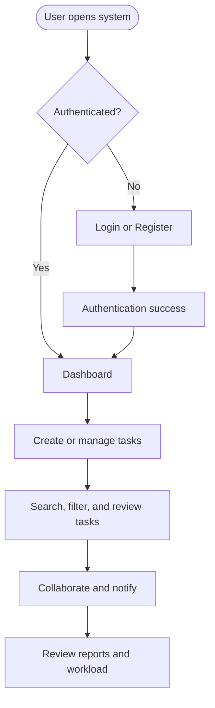

# Business Process Flows

## Purpose
Document the core business workflows for the Task Management System in a technology-agnostic manner.

## Metadata
- Version: 1.0
- Author: Business Analyst
- Date: 2026-07-04
- Workflow ID: WF-20260704-001
- Status: Draft

## Business Process Flows

### Process Name: User Authentication and Access
- Objective: Allow a user to securely access the system and reach the appropriate workspace.
- Trigger: A user opens the application or attempts to sign in.
- Preconditions: The user has a registered account or is creating a new one.
- Main Flow:
  1. The user opens the Login or Register experience.
  2. The user signs in with valid credentials or completes registration.
  3. The system grants access and routes the user to the Dashboard.
- Alternate Flow:
  1. The user selects password recovery.
  2. The user follows the recovery path and regains access.
- Exception Flow:
  1. Invalid credentials or a dependency failure are shown clearly.
  2. The user remains on the authentication experience without access.
- Postconditions: The user is authenticated and can access permitted features.
- Related User Stories: US-001
- Related Screens: Login, Register, Dashboard
- Related Business Rules: BR-001, BR-002
- Related Acceptance Criteria: AC-001 to AC-004

### Process Name: Task Creation and Update
- Objective: Capture work items and keep them current through the task lifecycle.
- Trigger: A user creates a new task or edits an existing task.
- Preconditions: The user is authenticated and has task access.
- Main Flow:
  1. The user enters task details, status, priority, and due date.
  2. The system validates the inputs and saves the task.
  3. The task appears in the task list and details view.
- Alternate Flow:
  1. The user duplicates an existing task and modifies the new copy.
- Exception Flow:
  1. Missing required values or invalid due dates prevent save.
  2. The user receives clear feedback and can correct the task data.
- Postconditions: The task is stored with visible status and audit history.
- Related User Stories: US-002
- Related Screens: Create Task, Edit Task, Task List, Task Details
- Related Business Rules: BR-003, BR-004, BR-005, BR-006, BR-007, BR-008
- Related Acceptance Criteria: AC-005 to AC-008

### Process Name: Task Search and Filtering
- Objective: Help users locate the right work quickly.
- Trigger: A user enters a search term or applies filters.
- Preconditions: The user is authenticated and visible tasks exist.
- Main Flow:
  1. The user enters search terms or selects filters.
  2. The system narrows the task list to visible matching tasks.
  3. The user reviews the results and opens the relevant task.
- Alternate Flow:
  1. The user changes sort order to review tasks by due date, priority, status, or recency.
- Exception Flow:
  1. No results are shown and the user sees a clear empty state.
- Postconditions: The user can review a focused set of relevant tasks.
- Related User Stories: US-003
- Related Screens: Task List
- Related Business Rules: BR-009
- Related Acceptance Criteria: AC-009 to AC-012

### Process Name: Collaboration and Notification Flow
- Objective: Keep task participants informed and aligned through comments, attachments, and notifications.
- Trigger: A task is updated or a user interacts with the collaboration area.
- Preconditions: The task exists and the user has task access.
- Main Flow:
  1. The user adds a comment or attachment to a task.
  2. The system records the collaboration event and updates activity history.
  3. Relevant users receive notifications based on their preferences.
- Alternate Flow:
  1. The user updates notification preferences from Settings.
- Exception Flow:
  1. Empty comments or unavailable collaborative data are handled with clear feedback.
- Postconditions: The task activity is visible and relevant users are informed.
- Related User Stories: US-004
- Related Screens: Task Details, Settings
- Related Business Rules: BR-011, BR-012
- Related Acceptance Criteria: AC-013 to AC-016

### Process Name: Reporting and Workload Review
- Objective: Help users understand current progress and workload.
- Trigger: A user opens the Dashboard or Reports area.
- Preconditions: The user is authenticated and has report access.
- Main Flow:
  1. The system gathers visible task and workload data.
  2. The user reviews summary metrics and reports.
  3. The user uses the insights to prioritize or review work.
- Alternate Flow:
  1. The user filters report views by team or user scope.
- Exception Flow:
  1. No reportable data or dependency failure results in a clear empty or unavailable state.
- Postconditions: The user has a visible summary of task and workload status.
- Related User Stories: US-005
- Related Screens: Dashboard, Reports
- Related Business Rules: BR-013
- Related Acceptance Criteria: AC-017 to AC-020

## Summary Diagram

## Notes
- The flows above are intentionally business-focused and implementation-neutral.
- Mermaid diagrams are included in the business requirements package summary where beneficial.
