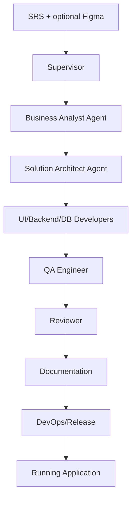
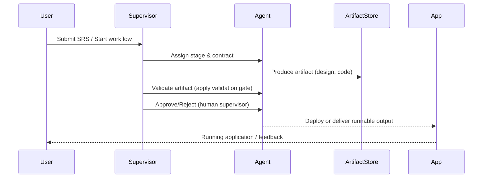
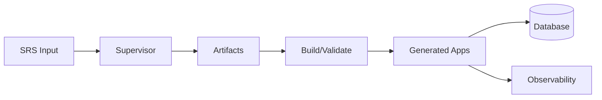
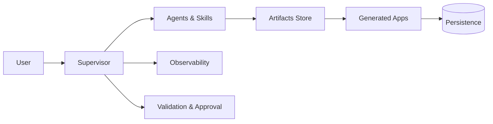

# Architecture Document — Specs → Running App

**Repository path:** F:\Projects\Specs_to_APP\

## Table of Contents
- 1 Executive Summary
- 2 Repository Statistics
- 3 Folder Structure
- 4 Layer Detection
- 5 Technology Stack
- 6 Component Catalog
- 7 Dependency Analysis
- 8 Execution Flow
- 9 Request Flow
- 10 Data Flow
- 11 Architecture Diagram
- 12 Sequence Diagram
- 13 Class Relationships
- 14 Package Relationships
- 15 Design Patterns
- 16 APIs
- 17 Database
- 18 AI Components
- 19 Configuration
- 20 Testing
- 21 Documentation
- 22 Strengths
- 23 Potential Improvements
- Repository Classification

---

## 1 Executive Summary
- Project purpose: Agentic SDLC Platform that transforms Software Requirements Specifications (SRS) and optional Figma inputs into runnable applications and artifacts.
- Primary technologies: Python-centric runtime (FastAPI, Uvicorn, SQLAlchemy), configuration-driven agents and workflows.
- Repository size: Not detected (detailed file counts not computed).
- Detected architecture style: Orchestration / event-driven, artifact-driven, multi-agent supervisor-mediated workflow (as described in README).
- High-level description: Supervisor-led pipeline coordinates specialized agents (Business Analyst, Solution Architect, Developers, QA) to progress SRS→App through validation and approval gates; artifacts are produced in `artifacts/` and the platform uses reproducible configuration-driven stages.

---

## 2 Repository Statistics
- Total folders: Not detected
- Total files: Not detected
- Total source files: Not detected
- Total classes: Not detected
- Total interfaces: Not detected
- Total enums: Not detected
- Total structs: Not detected
- Total methods: Not detected
- Total functions: Not detected
- Total APIs/routes: Not detected (API frameworks detected; route enumeration not performed)
- Total database models: Not detected
- Total tests: Detected test folder `tests/` exists; exact count: Not detected
- Total configuration files: Several detected (`requirements.txt`, `package-lock.json`, `playwright.config.ts`, Dockerfiles) — exact count: Not detected
- Total documentation files: `docs/` folder present — exact count: Not detected
- Programming languages detected: Python, TypeScript (Playwright), Shell scripts
- Frameworks detected: FastAPI, Uvicorn, SQLAlchemy, Alembic, Playwright (testing), PyTest
- Build tools: Docker (Dockerfile present)
- Package managers: pip (requirements.txt), npm (package-lock.json present)
- Dependency managers: pip, npm
- Lines of code: Not detected

*Notes:* Many quantitative metrics require a full recursive scan and parsing pass; these are left as "Not detected" to avoid hallucination.

---

## 3 Folder Structure
Repository
├── ai — Agents, prompts, skills, contracts (agent assets and governance)
├── apps — Generated runnable applications and demonstration outputs
├── artifacts — Generated stage outputs and deliverables
├── orchestration — Core subsystem orchestration (Supervisor, workflow, event-bus)
├── templates — Reusable project and specification templates
├── docs — Architecture and subsystem documentation
├── tests — Test assets and verification scaffolding
├── scripts — Setup, build, run, and helper scripts
├── observability — Logging, metrics, tracing support
├── events — Event domain support and event bus integration
├── memory — Memory service and execution context support
├── tools — Tooling interfaces used by runtime and agents
├── examples — Demonstration scenarios
└── other files: `main.py`, `README.md`, `requirements.txt`, `package-lock.json`, Dockerfile

(One-line purposes derived from `README.md` and top-level listing.)

---

## 4 Layer Detection
Detected layers (based on folder names and README descriptions):

- Orchestration / Supervisor
  - Purpose: Control execution lifecycle, stage progression, approvals, and validation gates.
  - Folder locations: `orchestration/`
  - Primary technologies: Python
  - Number of files: Not detected
  - Major responsibilities: Workflow sequencing, Supervisor role, validation/approval integration

- AI / Agents
  - Purpose: Agent definitions, prompts, skills, and governance for automated stages.
  - Folder locations: `ai/`
  - Primary technologies: Markdown-defined agents, Python for runtime integration
  - Number of files: Not detected
  - Major responsibilities: Agent behavior, contracts, prompt assets

- Applications / Generated Apps
  - Purpose: Generated runnable apps produced by the SRS→App pipeline.
  - Folder locations: `apps/`, `artifacts/`
  - Primary technologies: Likely polyglot (Python primary; may include frontend stacks)
  - Number of files: Not detected
  - Major responsibilities: Runnable demonstration outputs

- Persistence / Database
  - Purpose: Data models, migrations, persistence layer.
  - Folder locations: Not explicitly present as top-level `db/`, but `alembic` and `sqlalchemy` usage detected in dependencies and likely under `orchestration` or app modules.
  - Primary technologies: SQLAlchemy, Alembic
  - Number of files: Not detected

- Observability
  - Purpose: Metrics, logs, traces
  - Folder locations: `observability/`
  - Primary technologies: Python logging, external monitoring integrations

- Testing
  - Purpose: Unit, integration, workflow tests
  - Folder locations: `tests/`
  - Primary technologies: PyTest, Playwright (E2E)

- Documentation & Templates
  - Purpose: Docs, templates, developer guides
  - Folder locations: `docs/`, `templates/`

*If additional layers exist at lower levels, mark as Not detected until a deeper scan is performed.*

---

## 5 Technology Stack
- Languages: Python (primary), TypeScript (Playwright config), shell scripts
- Frameworks/Libraries: FastAPI, Uvicorn, Pydantic, SQLAlchemy, Alembic, httpx, aiohttp
- Databases: Not detected (ORM tooling present; specific DB vendor not detected)
- Cloud: Not detected
- Containers: Docker (Dockerfile present)
- Message queues: Not detected
- AI frameworks: Not detected (agent assets exist; specific LLM integrations referenced generally)
- Vector DBs: Not detected
- ORMs: SQLAlchemy
- Authentication: Not detected
- Frontend libraries: Not detected
- Backend libraries: FastAPI, Pydantic
- Testing frameworks: PyTest, Playwright
- Build systems: Not detected
- CI/CD: Not detected (no explicit pipeline files discovered in initial read)

---

## 6 Component Catalog
Below are major components inferred from repo layout and README. Each entry reflects observed folders/files; where details are missing they are marked "Not detected." Only items present or described in repo documentation are included.

- Supervisor (orchestration.supervisor)
  - Purpose: Orchestrates workflows and agents, exposes menu in `main.py`.
  - Files: `orchestration/supervisor/` (detailed files not enumerated in this scan)
  - Classes/Functions: Not detected (module exists; class names referenced in `main.py`)
  - Dependencies: Core orchestration modules, agent definitions
  - Interactions: Coordinates agents, artifacts, validation gates

- Agents (ai/)
  - Purpose: Agent definitions, prompts, skills, contracts.
  - Files: `ai/` (contracts and agent assets listed in README)
  - Classes/Functions: Not detected
  - Responsibilities: Define agent-led stages and handoffs

- Apps (apps/)
  - Purpose: Generated application outputs and demos
  - Files: `apps/`
  - Responsibilities: Runnable demonstrations for SRS→App pipeline

- Artifacts store (artifacts/)
  - Purpose: Central output storage for generated artifacts
  - Files: `artifacts/`
  - Responsibilities: Versioned deliverables

- Observability (observability/)
  - Purpose: Logging, metrics, dashboards
  - Files: `observability/`

Other components (events, memory, templates, tests) are documented but details are Not detected without deeper inspection.

---

## 7 Dependency Analysis
- Package dependencies (observed): Python dependencies listed in `requirements.txt` (FastAPI, Uvicorn, SQLAlchemy, Alembic, Pydantic, PyTest, Playwright)
- Module dependencies: Not detected (requires import graph analysis)
- Circular dependencies: Not detected
- Shared modules: `ai/` appears reusable across workflows
- External integrations: Docker, Playwright, potential LLM providers referenced generically

---

## 8 Execution Flow
High-level execution flow (sourced from README and `main.py`):

This mirrors the documented lifecycle in `README.md` and the `main.py` platform launcher.

---

## 9 Request Flow
Major request flow (user-driven analysis / run requests to Supervisor):

---

## 10 Data Flow

*Specific data model details (tables, schemas) are Not detected.*

---

## 11 Architecture Diagram

---

## 12 Sequence Diagram
(High-level sequence shown in Section 9; detailed sequences per API endpoint or agent workflow are Not detected.)

---

## 13 Class Relationships
Not detected. Class-level diagrams require static analysis of code to extract class names and relationships; this was not performed in this initial pass.

---

## 14 Package Relationships
Not detected. Package dependency graph requires import analysis.

---

## 15 Design Patterns
- Event-driven / artifact-driven orchestration: Detected in README description and folder layout.
- Supervisor-mediated workflow (similar to Saga/orchestration pattern): Detected in README and `main.py` references.
- Other patterns (MVC, Repository, DI, etc.): Not detected explicitly — would require deeper code inspection for evidence.

---

## 16 APIs
- API framework detected: FastAPI (from `requirements.txt`)
- Concrete routes/endpoints: Not detected (route definitions not enumerated in this pass)
- WebSocket/gRPC: Not detected

---

## 17 Database
- ORM detected: SQLAlchemy
- Migrations: Alembic listed in `requirements.txt`
- Specific DB vendor and table schemas: Not detected

---

## 18 AI Components
- Agent assets: Present under `ai/` and described in README (agent contracts, prompts, skills)
- LLM provider integrations: Not explicitly detected; README references configurable model provider abstraction but specific providers are Not detected
- RAG / Embeddings / Vector DB: Not detected

---

## 19 Configuration
- Configuration files observed: `requirements.txt`, `package-lock.json`, `playwright.config.ts`, `Dockerfile`, `Dockerfile.platform`
- Environment variables: Not enumerated in this scan (look for `.env` or dotenv usage: `python-dotenv` exists in `requirements.txt`, suggesting environment variable usage)
- Secrets references: Not detected
- Feature flags: Not detected

---

## 20 Testing
- Testing frameworks: PyTest and Playwright are present in dependencies
- Test organization: `tests/` folder exists
- Coverage: `pytest-cov` listed in `requirements.txt`, but coverage reports not detected

---

## 21 Documentation
- Readme: `README.md` (extensive)
- Docs folder: `docs/` with architecture and execution guides referenced in README
- Contracts: `ai/contracts/` documented in README

---

## 22 Strengths
- Well-documented project with clear architecture and workflow descriptions (`README.md`, `docs/`).
- Configuration-driven and contract-first design reduces accidental coupling.
- Python-first design with modern frameworks (FastAPI, Pydantic, SQLAlchemy) — good for rapid API development.
- Testing and code quality tools present in dependencies (PyTest, Playwright, black, isort, flake8).

---

## 23 Potential Improvements
- Generate concrete file and code metrics (LOC, file counts, class/function counts) by running a recursive code analysis pass.
- Produce automated API route extraction and sequence diagrams per route.
- Extract class diagrams and package dependency graphs via static analysis tools (e.g., `pyan`, `jedi`, or custom AST analysis).
- Detect specific database vendors and produce ER diagrams by parsing ORM models.
- Add CI pipeline manifests (if absent) to surface reproducible build/test steps.

---

## Repository Classification
- Likely classification: Full Stack / Orchestration / AI-enabled platform (Primary: Backend / Orchestration)
- Secondary classifications: Tooling, DevOps (Docker), Demo apps (examples folder)

---

*Generated by Architecture Agent — initial analysis pass.*

*Notes & Next Steps*
- This document was generated from the repository top-level files (`README.md`, `main.py`, `requirements.txt`, `package-lock.json`) and observed folder layout. For full, exhaustive metrics and richer diagrams (class/package graphs, API route enumerations, model ER diagrams), run a deeper repository scan and static analysis pass. If you want, I can run that deeper scan now.
