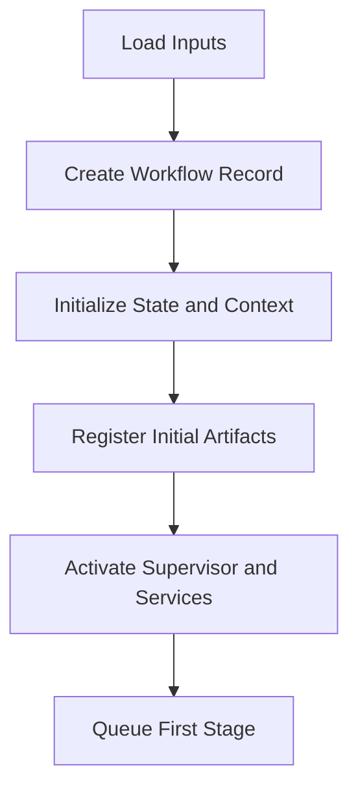
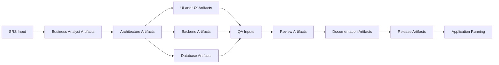
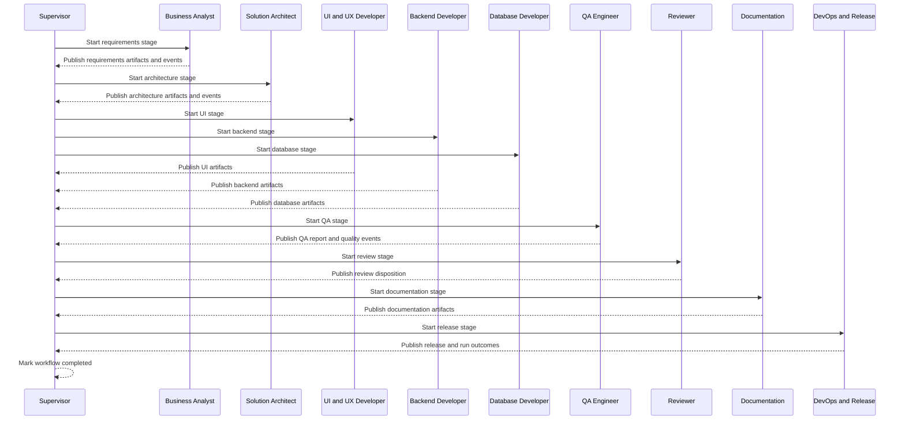

# Agentic SDLC Execution Flow Guide

Document Version: 1.0.0  
Effective Date: 2026-06-30  
Status: Approved

## 1. Purpose
This document explains the complete end-to-end execution flow of the Agentic SDLC platform from initial requirements intake to a locally running application.

The purpose of this guide is to provide:

1. A shared operational understanding of how autonomous stages execute.
2. Clear visibility into how artifacts, events, memory, validation, and approvals coordinate progression.
3. An enterprise-level reference for engineering teams implementing, operating, or governing the platform.

This document is an execution guide, not an implementation specification.

## 2. Inputs
Platform execution begins with four input classes.

1. Software Requirements Specification
The primary business and product intent input that defines required outcomes, constraints, and scope.

2. Figma URL, optional
A design reference input used by design and implementation stages when visual requirements are provided.

3. Workflow configuration
Defines stage sequence, dependency rules, retry behavior, and completion criteria.

4. Platform configuration
Defines contracts, policies, model settings, thresholds, service behavior, and observability controls.

## 3. Startup Sequence
Before stage execution begins, the runtime performs a deterministic startup sequence.

1. Loading configuration
Runtime loads platform and workflow configuration and verifies version compatibility.

2. Loading workflow
Workflow model is loaded, parsed, and validated for stage order, dependencies, and transitions.

3. Initializing Supervisor
Supervisor establishes orchestration authority, governance context, and execution identifiers.

4. Initializing services
Core subsystems are initialized, including workflow engine, event bus, memory, artifact manager, validation, approval, and observability.

5. Registering agents
Agent definitions are discovered, validated against agent contract expectations, and registered by role and capability.

6. Loading memory
Workflow memory and any required execution history are loaded for continuity and recovery readiness.

7. Preparing execution
Initial workflow state and baseline artifact references are created, and the first stage is queued.

## 4. Workflow Initialization
Workflow initialization creates the execution envelope for the full SDLC run.

1. Workflow creation
A new workflow record is created with workflow identity, execution identity, and initial state.

2. Workflow state
State starts at created, progresses to queued, and transitions to running when prerequisites are satisfied.

3. Artifact initialization
Initial input artifacts are registered, including specification and optional design references.

4. Execution context
Context references are assembled from configuration, memory, input artifacts, and policy controls.

## 5. End-to-End Agent Execution
The platform executes the following stage sequence:

Supervisor -> Business Analyst -> Solution Architect -> UI and UX Developer -> Backend Developer -> Database Developer -> QA Engineer -> Reviewer -> Documentation -> DevOps and Release -> Application Running

### 5.1 Supervisor
Purpose:
Owns orchestration decisions, state transitions, and governance.

Inputs:
Specification input, workflow and platform configuration, subsystem health, events, approvals.

Artifacts consumed:
Input specification and previously published stage outputs.

Artifacts produced:
Workflow initialization records, orchestration summaries, approval references, completion summary references.

Events emitted:
Workflow lifecycle events, pause and resume events, completion and failure events.

Validation:
Validates transition legality, dependency readiness, and policy compliance before progression.

Memory interaction:
Reads and updates workflow memory, execution pointers, and approval context references.

Completion criteria:
All required stages complete, mandatory validations pass, and terminal criteria are satisfied.

### 5.2 Business Analyst
Purpose:
Transforms specification into structured business and delivery requirements.

Inputs:
Software Requirements Specification, optional Figma context, policy constraints.

Artifacts consumed:
Specification input artifacts.

Artifacts produced:
Requirements, business rules, epics, features, user stories, acceptance criteria, behavior scenarios.

Events emitted:
Stage started, artifacts created, validation outcomes, stage completed or blocked.

Validation:
Checks completeness, traceability to source requirements, and structural correctness.

Memory interaction:
Reads initial context and writes requirement lineage references and open question context.

Completion criteria:
All required requirement artifacts published and validated.

### 5.3 Solution Architect
Purpose:
Creates architecture and interface contracts from approved requirements.

Inputs:
Requirements artifacts and policy constraints.

Artifacts consumed:
Requirements, business rules, features, acceptance criteria, behavior scenarios.

Artifacts produced:
Architecture document, API contracts, architectural decision context.

Events emitted:
Architecture stage lifecycle and artifact publication events.

Validation:
Validates design consistency, dependency integrity, contract compliance, and traceability.

Memory interaction:
Reads requirement context and writes architecture decision and dependency references.

Completion criteria:
Architecture and interface artifacts validated and published.

### 5.4 UI and UX Developer
Purpose:
Defines user experience and interface specifications aligned to architecture and requirements.

Inputs:
Requirements, architecture outputs, optional Figma URL.

Artifacts consumed:
Requirements and architecture artifacts, design references.

Artifacts produced:
Frontend specification and UI design deliverables.

Events emitted:
Design lifecycle, artifact publication, validation outcome events.

Validation:
Validates accessibility intent, consistency with requirements, and architecture alignment.

Memory interaction:
Reads design context and writes UI dependency and decision references.

Completion criteria:
UI and frontend specifications validated and published.

### 5.5 Backend Developer
Purpose:
Defines backend service behavior and implementation-facing backend specifications.

Inputs:
Requirements, architecture contracts, UI data requirements, business rules.

Artifacts consumed:
Requirements outputs, architecture outputs, interface and dependency context.

Artifacts produced:
Backend specification and backend implementation outputs where applicable.

Events emitted:
Backend stage lifecycle, artifact publication, validation outcomes.

Validation:
Validates service contract compliance, dependency integrity, and traceability.

Memory interaction:
Reads upstream technical context and writes backend dependency and execution references.

Completion criteria:
Backend artifacts are validated, published, and dependency-complete.

### 5.6 Database Developer
Purpose:
Defines data model, schema constraints, and migration strategy.

Inputs:
Requirements, architecture outputs, backend needs, business rules.

Artifacts consumed:
Requirements and architecture artifacts, backend dependency context.

Artifacts produced:
Database schema and migration artifacts.

Events emitted:
Database lifecycle and artifact publication events.

Validation:
Validates referential integrity, schema completeness, and compatibility.

Memory interaction:
Reads prior technical context and writes schema lineage and migration references.

Completion criteria:
Database artifacts validated, published, and available for downstream quality and release stages.

### 5.7 QA Engineer
Purpose:
Verifies outputs against acceptance criteria, behavior scenarios, and quality gates.

Inputs:
All relevant implementation and design artifacts, acceptance criteria, behavior scenarios.

Artifacts consumed:
Frontend, backend, database, and requirements-related artifacts.

Artifacts produced:
Test cases, test reports, QA report, defect and risk context.

Events emitted:
Validation and quality outcome events, stage completion or block events.

Validation:
Validates test coverage integrity, result consistency, and gate thresholds.

Memory interaction:
Reads full execution context and writes quality findings and risk references.

Completion criteria:
Quality evidence published with explicit recommendation.

### 5.8 Reviewer
Purpose:
Performs governance and readiness review across quality, compliance, and risks.

Inputs:
All prior stage outputs, QA findings, policy constraints.

Artifacts consumed:
Architecture, implementation, QA, and supporting artifacts.

Artifacts produced:
Review report and decision recommendations.

Events emitted:
Review completion, approval-required, or blocked events.

Validation:
Validates compliance with contracts, policies, and governance expectations.

Memory interaction:
Reads quality and execution history, writes governance findings and unresolved risks.

Completion criteria:
Review outcomes published with clear disposition and traceability.

### 5.9 Documentation
Purpose:
Produces final operational and user-facing documentation.

Inputs:
Approved technical and governance artifacts.

Artifacts consumed:
Architecture, implementation, QA, and review outputs.

Artifacts produced:
Readme, setup guidance, operational documentation.

Events emitted:
Documentation publication and completion events.

Validation:
Validates documentation completeness, consistency, and references.

Memory interaction:
Reads finalized context and writes documentation trace references.

Completion criteria:
Documentation artifacts published and validated.

### 5.10 DevOps and Release
Purpose:
Finalizes release readiness and local run outcomes.

Inputs:
All prior published artifacts, quality and review disposition, release policy.

Artifacts consumed:
Implementation outputs, QA and review reports, documentation outputs.

Artifacts produced:
Release notes, deployment scripts, build outputs, run outcome records.

Events emitted:
Release lifecycle, run readiness, completion or failure events.

Validation:
Validates release prerequisites, rollback readiness, and final operational checks.

Memory interaction:
Reads complete workflow context and writes release outcome and closure references.

Completion criteria:
Application is successfully built and runs locally with required reports finalized.

## 6. Artifact Flow
Artifacts move forward through stage ownership and dependency-driven consumption.

1. Input artifacts are registered at workflow initialization.
2. Each stage consumes only required published artifacts.
3. Each stage publishes owner-scoped outputs.
4. Downstream stages unlock only when dependency artifacts are validated and available.
5. Artifact lineage is preserved through versioning and traceability references.

## 7. Event Flow
Events coordinate execution without embedding business payload logic.

1. Stage start and completion events drive progression awareness.
2. Artifact publication events signal downstream readiness.
3. Validation events gate stage exit and entry transitions.
4. Approval events coordinate paused and resumed execution paths.
5. Failure and retry events drive recovery and escalation behavior.
6. Terminal events signal completed, failed, or cancelled outcomes.

Event flow is correlated by workflow and execution identifiers for deterministic sequencing and diagnostics.

## 8. Memory Flow
Memory provides contextual continuity across all stages.

1. Shared memory stores cross-stage references and resolved context.
2. Workflow memory stores state pointers, dependency indexes, approvals, and lifecycle references.
3. Execution history stores attempts, retries, transitions, and outcomes for recovery and auditing.

Memory operations by stage:

1. Before stage execution, required context is assembled from workflow, shared, and history scopes.
2. After stage execution, outputs, validation references, and decisions are written as new memory entries.
3. Recovery and resume paths use memory checkpoints and execution history for safe continuation.

## 9. Validation Flow
Validation is enforced before and after each stage.

1. Pre-stage validation
Input artifacts, dependencies, configuration, and stage readiness are validated before dispatch.

2. In-stage validation
Produced outputs are checked for structure, completeness, integrity, and contract compliance.

3. Post-stage validation
Publication readiness, traceability, and downstream dependency compatibility are verified.

4. Gate effect
Only validated outputs and successful gate results allow transition to the next stage.

## 10. Approval Flow
Approval flow is activated only when policy requires human decision.

1. Agent identifies ambiguity, exception, or risk beyond autonomous authority.
2. Agent emits blocked and approval-requested events and publishes open question and approval request context.
3. Supervisor pauses workflow and creates approval request through Approval Service.
4. Approval decision is recorded as approved, rejected, expired, or cancelled.
5. Supervisor applies decision and resumes, retries, reroutes, or terminates workflow according to policy.

Agents never communicate directly with humans.

## 11. Error Handling
Execution errors are handled by severity and recoverability.

1. Recoverable errors
Transient or fixable issues trigger bounded retries and controlled revalidation.

2. Retries
Retry policy applies to eligible failure classes and tracks attempt history.

3. Blocked workflows
Unresolved dependencies or required decisions move workflow into blocked or waiting-approval states.

4. Failures
Non-recoverable errors transition workflow to failed with full diagnostic and audit context.

5. Recovery
Recovery uses state persistence, memory snapshots, and artifact lineage to resume from safe checkpoints.

## 12. Completion
Supervisor determines successful workflow completion when all required conditions are true.

1. All mandatory stages reached completed state.
2. Required artifacts are published and dependency-complete.
3. Validation and quality thresholds are satisfied.
4. Required approvals are resolved.
5. Release and local run criteria are met.
6. Terminal completion event and execution summary are published.

## 13. Outputs
The end-to-end workflow produces the following output classes.

1. Generated application ready to run locally.
2. Documentation including operational and usage guidance.
3. Tests and test execution outputs.
4. Deployment scripts and release notes.
5. Reports including QA, review, validation, and quality outputs.
6. Logs from stage, workflow, and subsystem execution.
7. Metrics and traces for observability and diagnostics.
8. Audit records for governance, approvals, and lifecycle evidence.

## 14. Example Execution
This example summarizes a complete Task Management System run from SRS input to local application execution.

1. Intake and startup
SRS and optional Figma URL are loaded, workflow is initialized, services are started, and Supervisor activates execution.

2. Requirements elaboration
Business Analyst publishes requirements and acceptance artifacts, enabling architecture stage readiness.

3. Architecture definition
Solution Architect publishes architecture and interface artifacts consumed by technical stages.

4. Technical specification and implementation outputs
UI and UX, backend, and database stages publish their artifacts with validation and dependency traceability.

5. Quality and governance
QA verifies outputs and publishes quality evidence. Reviewer assesses compliance and readiness.

6. Documentation and release preparation
Documentation produces final guidance. DevOps and Release publishes release and run outputs.

7. Local run and closure
Application runs locally, completion criteria are met, workflow is marked completed, and final reports and audit records are finalized.

## 15. Future Workflow Extensions
The execution model supports controlled expansion without changing core governance semantics.

1. Additional agents
New role-specific stages can be inserted through configuration and contract-conformant definitions.

2. Custom workflows
Domain-specific stage sequences can be created while preserving contract and validation gates.

3. Parallel workflows
Eligible independent branches can execute in parallel under explicit dependency and policy controls.

4. Plugin workflows
Reusable workflow plugins can contribute optional stages, rules, and reports while preserving deterministic orchestration.

Future extensions must preserve local-first operation, single-runtime governance, contract-first interoperability, and Supervisor-mediated control.
